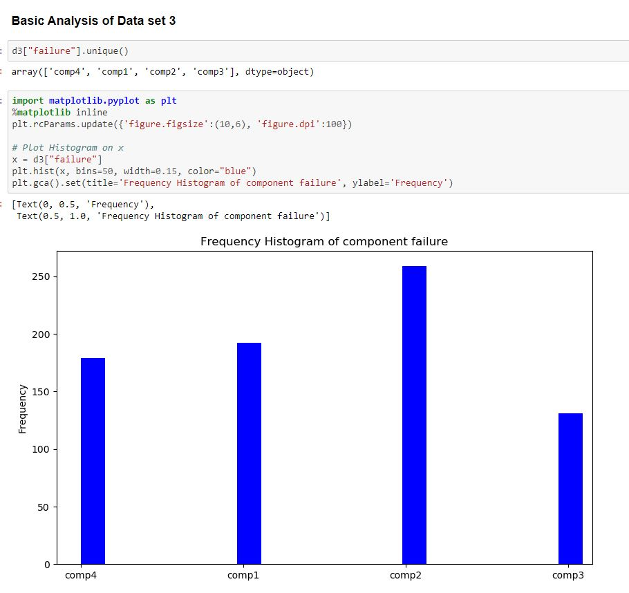

# Hackathon-LetsUpgrade  
Hack with LetsUpgrade is a 36 hours-long program conducted by LetsUpgrade. Exposure to real time projects.This organization aims to help the new developers to get best opportunities like jobs and internships, by contributing their projects to this hackathon and top winners will be surprised with new goodies and cash prizes.

# Theme: Artificial Intelligence/Data Science/Analytics
1.Analyze

2.Predict

3.Many More Etc...

## Team- Gearhead
### Members- Aditya lahariya, Mohammed Azeem, Vikas Yadav
### Project- Predictive maintenance (PdM) (A Microsoft Azure case study)

# Understanding the Domain 

# Problem Description

A major problem faced by businesses in asset-heavy industries such as manufacturing is the significant costs that are associated with delays in the production process due to mechanical problems. Most of these businesses are interested in predicting these problems in advance so that they can proactively prevent the problems before they occur which will reduce the costly impact caused by downtime. 

The problem is formatted as a multi-class classification problem and a machine learning algorithm is used to create the predictive model that learns from historical data collected from machines.

# Types of Maintenance:

-  **Reactive maintenance** (also known as breakdown maintenance)  refers to	repairs that are done when equipment has already  broken down, in	order to restore the equipment to its normal  operating condition.

- **Preventive maintenance** (or preventative maintenance) is maintenance that is regularly performed on a piece of equipment to lessen the likelihood of it failing. It is performed while the equipment is still working so that it does not break down unexpectedly.

- **Predictive maintenance** is a proactive maintenance strategy that tries  to predict when a piece of equipment might fail so that maintenance  work can be performed just before that happens.

## **Goal** : 
The goal of predictive  maintenance is to optimize the  balance between corrective and  preventative maintenance, by  enabling just in time replacement  of components. This approach  only replaces those components  when they are close to a failure.

## **Use Case of PdM**:
Any predictive maintenance use case begin with  understanding the business problem and defining the  objective. Following are some of the common questions  which are asked in Predictive Maintenance
 - What failure could occur within next 24 hours for my  vehicle?
 
 - What is the remaining useful life (RUL) of a vehicle’s  component?
 
 - What are the causes of failure of my vehicle and what  action should be taken to fix it?

## Business problems in PdM

Businesses face high operational risk due to unexpected failures and have limited insight into the root cause of problems in complex systems. Some of the key business questions are:

- Detect anomalies in equipment or system performance or functionality.
- Predict whether an asset may fail in the near future.
- Estimate the remaining useful life of an asset.
- Identify the main causes of failure of an asset.
- Identify what maintenance actions need to be done, by when, on an asset.

## Typical goal statements from PdM are:

- Reduce operational risk of mission critical equipment.
- Increase rate of return on assets by predicting failures before they occur.
- Control cost of maintenance by enabling just-in-time maintenance operations.
- Lower customer attrition, improve brand image, and lost sales.
- Lower inventory costs by reducing inventory levels by predicting the reorder point.
- Discover patterns connected to various maintenance problems.
- Provide KPIs (key performance indicators) such as health scores for asset conditions.
- Estimate remaining lifespan of assets.
- Recommend timely maintenance activities.
- Enable just in time inventory by estimating order dates for replacement of parts.

These goal statements are the starting points for:
- data scientists to analyze and solve specific predictive problems.

## **Objective**: 
To train a Machine Learning model to predict the  probability that a machine will fail 24 hours prior  to the breakdown, due to a certain component  failure (component 1, 2, 3, or 4)

## Data preparation for predictive maintenance
### Data sources
The relevant data sources for predictive maintenance include, but are not limited to:

- Machine operating conditions & usage (telemetry data)
- Error History/ logs
- Failure history
- Equipment metadata
- Maintenance/repair history (components)

## Machine conditions and usage (Telemetry data):
Sensor based (or other) streaming data of the equipment in operation is an important data source. A key assumption in PdM is that a machine's health status degrades over time during its routine operation. The data is expected to contain time-varying features that capture this aging pattern, and any anomalies that leads to degradation. The temporal aspect of the data is required for the algorithm to learn the failure and non-failure patterns over time. Based on these data points, the algorithm learns to predict how many more units of time a machine can continue to work before it fails.

## Error History : 
These are non-breaking errors thrown while the  machine is still operational and do not constitute  as failures.

## Failure history
Failure events are rare in PdM applications. However, when building prediction models, the algorithm needs to learn about a component's normal operational pattern, as well as its failure patterns. So the training data should contain sufficient number of examples from both categories. Maintenance records and parts replacement history are good sources to find failure events. With the help of some domain knowledge, anomalies in the training data can also be defined as failures.

## Machine features / equipment data:
metadata about the equipment. Examples are the equipment make, model, manufactured date, start date of service, location of the system, and other technical specifications.

## Maintenance/repair history (components)
Maintenance history of an asset contains details about components replaced, repair activities performed etc. These events record degradation patterns. Absence of this crucial information in the training data can lead to misleading model results. Failure history can also be found within maintenance history as special error codes, or order dates for parts. Additional data sources that influence failure patterns should be investigated and provided by domain experts.

# Data types

Given the above data sources, the two main data types observed in PdM domain are:

**Temporal data:** Operational telemetry, machine conditions, work order types, priority codes that will have timestamps at the time of recording. Failure, maintenance/repair, and usage history will also have timestamps associated with each event.

**Static data:*** Machine features and operator features in general are static since they describe the technical specifications of machines or operator attributes. If these features could change over time, they should also have timestamps associated with them.

# Exploring the data sets

## Dtat set 1- Telemetry Data
The first data source is the telemetry time-series data which consists of voltage, rotation, pressure, and vibration measurements collected from 100 machines in real time averaged over every hour collected during the year 2015. Below, we display the first 10 records in the dataset. A summary of the whole dataset is also provided.

**Mean voltage**

**Machine-wise maximum pressure**

**Check for auto correlation**

## Plotting the trend chart for the mean of various features.

## Removing of the trend if any

## Dtat set 2- Error History 
The second major data source is the error logs. These are non-breaking errors thrown while the machine is still operational and do not constitute as failures. The error date and times are rounded to the closest hour since the telemetry data is collected at an hourly rate.

## Dtat set 3- Failure history
These are the records of component replacements due to failures. Each record has a date and time, machine ID, and failed component type.

## Dtat set 4- Machine features
This data set includes some information about the machines: model type and age (years in service).

## Dtat set 5- Maintenance
These are the scheduled and unscheduled maintenance records which correspond to both regular inspection of components as well as failures. A record is generated if a component is replaced during the scheduled inspection or replaced due to a breakdown. The records that are created due to breakdowns will be called failures

# Feature Engineering

## - Aggregation of Telemetry data for 3H

## - Aggregation of Telemetry data for 24H

## Concat both the above file 

## Number of days since the last replacement was done

# Final data set

 

